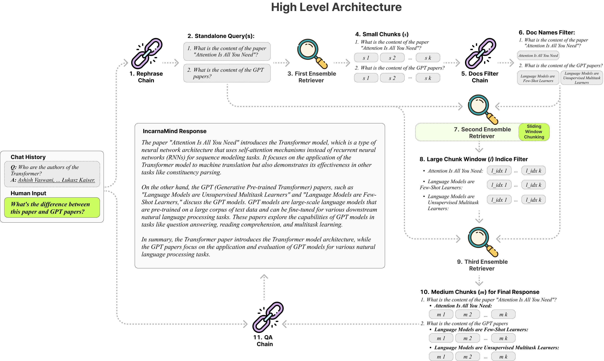
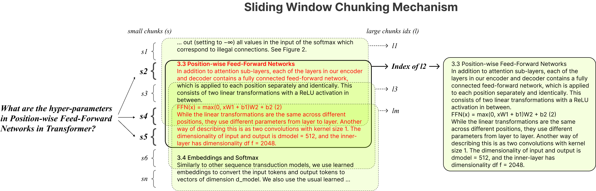

# 🧠 IncarnaMind

## 👀 In a Nutshell

IncarnaMind enables you to chat with your personal documents 📁 (PDF, TXT) using Large Language Models (LLMs) like GPT ([architecture overview](#high-level-architecture)). While OpenAI has recently launched a fine-tuning API for GPT models, it doesn't enable the base pretrained models to learn new data, and the responses can be prone to factual hallucinations. Utilize our [Sliding Window Chunking](#sliding-window-chunking) mechanism and Emsemble Retriever enable efficient querying of both fine-grained and coarse-grained information within your ground truth documents to augment the LLMs.

Please feel free to use it and welcome any feedback and new feature suggestions.

Powered by [Langchain](https://github.com/langchain-ai/langchain) and [Chroma DB](https://github.com/chroma-core/chroma).

## 💻 Demo

https://github.com/junruxiong/IncarnaMind/assets/44308338/89d479fb-de90-4f7c-b166-e54f7bc7344c

## 💡 Challenges Addressed

- **Fixed Chunking**: Our Sliding Window Chunking technique provides a balanced solution in terms of time, computing power, and performance.

- **Precision vs. Semantics**: Small chunks enable fine-grained information retrieval, while large chunks focus on coarse-grained data. We leverage both embedding-based and BM25 methods for a hybrid search approach.

- **Single-Document Limitation**: IncarnaMind supports multi-document querying, breaking the one-document-at-a-time barrier.

- **Stability**: We use Chains instead of Agent to ensure stable parsing across different LLMs.

## 🎯 Key Features

- **Adaptive Chunking**: Dynamically adjust the size and position of text chunks to improve retrieval augmented generation (RAG).

- **Multi-Document Conversational QA**: Perform simmple and multi-hop queries across multiple documents simultaneously.

- **File Compatibility**: Supports both PDF and TXT file formats.

- **LLM Model Compatibility**: Supports both OpenAI GPT and Anthropic Claude models.

## 🏗 Architecture

### High Level Architecture



### Sliding Window Chunking



## 🚀 Getting Started

### 1. Installation

The installation is simple, you just need run few commands.

#### 1.0. Prerequisites

- 3.8 ≤ Python < 3.11 with [Conda](https://www.anaconda.com/download)
- [OpenAI API Key](https://beta.openai.com/signup) or [Anthropic Claude API Key](https://console.anthropic.com/account/keys)
- And of course, your own documents.

#### 1.1. Clone the repository

```shell
git clone https://github.com/junruxiong/IncarnaMind
cd IncarnaMind
```

#### 1.2. Setup

Create Conda virtual environment

```shell
conda create -n IncarnaMind python=3.10
```

Activate

```shell
conda activate IncarnaMind
```

Install all requirements

```shell
pip install -r requirements.txt
```

Setup your API keys in **configparser.ini** file

```shell
[tokens]
OPENAI_API_KEY = sk-(replace_me)
and/or
ANTHROPIC_API_KEY = sk-(replace_me)
```

(Optional) Setup your custom parameters in **configparser.ini** file

```shell
[parameters]
PARAMETERS 1 = (replace_me)
PARAMETERS 2 = (replace_me)
...
PARAMETERS n = (replace_me)
```

### 2. Usage

#### 2.1. Upload and process your files

Put all your files (please name each file correctly to maximize the performance) into the **/data** directory and run the following command to ingest all data:
(You can delete example files in the **/data** directory before running the command)

```shell
python docs2db.py
```

#### 2.2. Run

In order to start the conversation, run a command like:

```shell
python main.py
```

#### 2.3. Chat and ask any questions

Wait for the script to require your input like the below.

```shell
Human:
```

#### 2.4. Others

When you start a chat, the system will automatically generate a **IncarnaMind.log** file.
If you want to edit the logging, please edit in the **configparser.ini** file.

```shell
[logging]
enabled = True
level = INFO
filename = IncarnaMind.log
format = %(asctime)s [%(levelname)s] %(name)s: %(message)s
```

## 🚫 Limitations

- Citation is not supported for current version, but will release soon.
- Limited asynchronous capabilities.

## 📝 Upcoming Features

- Frontend UI interface
- OCR support
- Asynchronous optimization
- Support open source LLMs
- Support more document formats

## 📑 License

[Apache 2.0 License](LICENSE)

## 🖋 Citation

If you want to cite our work, please use the following bibtex entry:

```bibtex
@misc{IncarnaMind2023,
  author = {Junru Xiong},
  title = {IncarnaMind},
  year = {2023},
  publisher = {GitHub},
  journal = {GitHub Repository},
  howpublished = {\url{https://github.com/junruxiong/IncarnaMind}}
}
```
