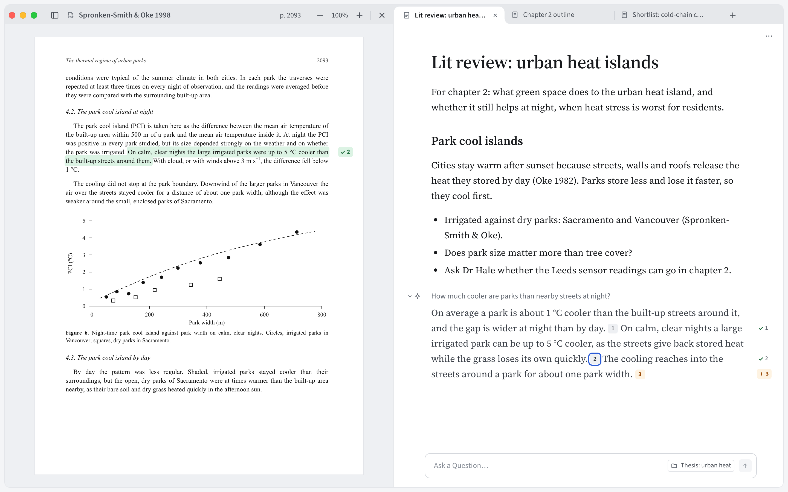

<!-- README.md and README.zh-CN.md match section for section. Change them together. -->

<p align="center"><b>English</b> · <a href="README.zh-CN.md">简体中文</a></p>

<h1 align="center">IncarnaMind</h1>

<p align="center">
  <b>The AI notebook that checks its own citations.</b><br>
  Write and ask questions in one place. Answers come from your own files, cite exactly where each claim came from, and every quote is checked against it. Free and open source, on your computer.
</p>

<p align="center">
  <a href="https://github.com/junruxiong/IncarnaMind/releases"><b>Releases</b></a> ·
  <a href="#how-it-works">How it works</a> ·
  <a href="#your-files-stay-yours">Privacy</a> ·
  <a href="#questions">FAQ</a> ·
  <a href="https://github.com/junruxiong/IncarnaMind/discussions">Discussions</a>
</p>

<p align="center">
  
  <a href="LICENSE"></a>
  <!-- After the first release, add: <a href="https://github.com/junruxiong/IncarnaMind/releases/latest"></a> -->
</p>

<p align="center">
  
</p>

> [!NOTE]
> **IncarnaMind isn't released yet.** The desktop app is in development. To hear when the first release is out, click **Watch → Custom → Releases** at the top of this page. Looking for the 2023 command-line tool? It's at the [`v1-python-cli`](https://github.com/junruxiong/IncarnaMind/tree/v1-python-cli) tag.

## Why IncarnaMind

For anyone who writes from documents: papers, reports, contracts, notes.

- **Answers you can check.** Every answer cites where it came from and carries the quote. When the answer is done, IncarnaMind looks for each quote in the place it cites: a green check if it's there, an amber mark if it isn't. Click a citation to open the file at that place, with the quote highlighted.
- **A notebook, not a chat.** You write in a *Mind*, a notebook for one topic or project. Ask a question anywhere in it, and the answer lands right there in your draft, as text you can edit.
- **Your files stay where they are.** Point IncarnaMind at the folders you already use, like a folder of papers or contracts, or Zotero's storage folder. It reads your files in place, never moves, renames or changes them, and keeps up as they change.
- **The files you actually use.** PDF, Word, PowerPoint, Excel, CSV, Markdown and plain text.
- **Your choice of AI.** Use your own OpenAI, Anthropic or Google key, any OpenAI-compatible server, or a free local model through Ollama, so nothing leaves your computer.
- **Ready to hand in.** Export to Word with your citations as footnotes, or to Markdown. Citations that didn't pass the check are marked "[unverified]".

## How it works

1. **Add your files.** Link a folder or add single files. Each one is searchable as soon as it's read, and nothing is uploaded.
2. **Write and ask.** Start a Mind and write as you normally would. When you need something from your files, ask a question right where you are. Type `@` to search only some folders, tags or files.
3. **Check, then use.** Click a citation to read its quote and see whether it was found, and open the page. Keep what's useful and edit the rest.

Want to look around first? On a first run, IncarnaMind offers an example Mind, *Where tea comes from*, that works before you set up any AI model.

### Where a citation points

| In a… | a citation points to… |
| --- | --- |
| PDF | the page |
| PowerPoint deck | the slide, speaker notes included |
| Excel sheet or CSV | the sheet and the rows |
| Word or Markdown file | the section the quote sits under |
| Text file | the lines |

"Quote found" means the quoted words really are in that place. It doesn't prove your sentence is right, which is why the page is always one click away. "Can't check" means there's no text to compare against, as on a scanned page.

## Your files stay yours

There's no account and no IncarnaMind server.

| What | Where it goes |
| --- | --- |
| Your Minds and the search index | One data folder on your computer |
| Your files | Nowhere. They stay where you keep them, unchanged |
| A question and the passages found for it | To the AI model you picked, or nowhere if it's a local model |
| API keys | Your system's secure storage, encrypted |
| Usage data | Not collected |
| Crash reports | Off unless you turn them on, and stripped of your content |

The first time IncarnaMind would send anything to an outside service, it shows you what would be sent and to whom, and waits for your OK. **Settings → Privacy** lists each one and lets you take it back.

**You stay in control of what runs.** Before a Connector's tool that could change something, or a Skill's script, runs, IncarnaMind asks you first: allow it once, always allow it, or deny it. **Settings → Tools** lists every rule you've set, and you can revoke any of them.

## More you can do

- **Stay organised.** Folders and Tags keep a big library tidy. Tags can be added for you, and the ones you set yourself are never changed.
- **Connect your apps.** Add Connectors (MCP servers), or bring over the ones you set up in Claude Desktop or Cursor. Anything that could change something asks you first.
- **Teach it your way.** Add Skills (standard `SKILL.md` folders) for answers to follow. Three come built in: summarise a document, write a literature review across documents, and turn a Mind into a report. A Skill's scripts run only after you approve them.
- **English and Chinese.** The whole app is in both.

## Coming next

Planned, and not available yet. The plans are in the [roadmap issue](https://github.com/junruxiong/IncarnaMind/issues/74), with no dates.

- **Meetings.** A live transcript made on your computer, or in the cloud with your own key, with speakers told apart and a summary that cites the transcript.
- **Word, both ways.** Open Word files and export them back, with your changes as tracked changes.
- **Check a draft.** Check your own sentences, and other people's documents, against your files.
- **Tasks.** Research that runs in the background while you do something else.

## Download

IncarnaMind isn't released yet, so there's nothing to download. To try it now, [run it from source](#contributing). Once the first release is out, the [Releases page](https://github.com/junruxiong/IncarnaMind/releases) will have an installer for each system:

| Your computer | You'll download |
| --- | --- |
| Mac with Apple silicon (M1 or later) | `IncarnaMind-<version>-mac-arm64.dmg` |
| Mac with an Intel chip | `IncarnaMind-<version>-mac-x64.dmg` |
| Windows (64-bit) | `IncarnaMind-<version>-win-x64.exe` |
| Linux (64-bit) | `IncarnaMind-<version>-linux-x86_64.AppImage` |

IncarnaMind checks for a new version each time it starts. On Windows, in the Linux AppImage and in a signed macOS build, it downloads the update in the background and installs it when you quit, or straight away if you choose **Restart now**.

<details>
<summary><b>Windows says "Windows protected your PC"</b></summary>

The installer isn't code-signed yet, so Microsoft Defender SmartScreen stops it the first time. Click **More info**, then **Run anyway**. If your browser flags the download, choose **Keep**.

</details>

<details>
<summary><b>macOS says it can't verify IncarnaMind</b></summary>

Until the Mac app is signed and notarized, macOS refuses to open it with "Apple could not verify 'IncarnaMind' is free of malware". To open it anyway:

1. Open IncarnaMind once, and click **Done** in the warning.
2. Open **System Settings → Privacy & Security**, scroll down to **Security**, and click **Open Anyway** next to the message about IncarnaMind.
3. Confirm with your password or Touch ID, then click **Open Anyway** again.

macOS remembers your choice. Or, in Terminal: `xattr -dr com.apple.quarantine /Applications/IncarnaMind.app`.

An unsigned Mac app can't update itself: when a new version is out, IncarnaMind tells you and offers its download page. Install it the same way, replacing the old app.

</details>

<details>
<summary><b>The Linux AppImage doesn't start</b></summary>

Make it executable: `chmod +x IncarnaMind-*.AppImage`. On Ubuntu 22.04 or later, also install FUSE 2: `sudo apt install libfuse2` (`libfuse2t64` on 24.04 and later).

</details>

## Questions

**Is it free?**
Yes. IncarnaMind is open source under the Apache 2.0 licence. If you use a cloud AI model, you pay that provider for what you use. A local model costs nothing.

**Do I need an API key?**
No. If [Ollama](https://ollama.com) is running, IncarnaMind can download a local model in one click. Or paste a key from OpenAI, Anthropic or Google, or connect any OpenAI-compatible server.

**Does it work offline?**
Searching your files does: search works on the words in your files, and the optional meaning-based search (embeddings) is off by default. Answers need an AI model, so with a local model everything works offline.

**Will it change my files?**
No. It reads them where they are. It only writes to its own data folder and to the files you export.

**What does "Quote found" mean, exactly?**
That the quoted words are in the place the citation names. It doesn't mean they prove the sentence. "Can't check" means there's no text to compare against, as on a scanned page.

**How is this different from asking a chatbot about a PDF?**
You write and ask in one document instead of a chat. Every quote is checked against the place it cites. And your files stay on your computer, with a local model if you like.

**How do I back up?**
Copy the data folder: it holds your Minds, the search index and your settings. Your files are your own, so back them up as you already do.

## Contributing

IncarnaMind is built in the open, and help is welcome: code, testing with your own documents, translations and ideas.

- Found a bug, or want a feature? [Open an issue](https://github.com/junruxiong/IncarnaMind/issues/new/choose).
- Questions and ideas: [Discussions](https://github.com/junruxiong/IncarnaMind/discussions).
- New to the code? Pick an issue labelled [good first issue](https://github.com/junruxiong/IncarnaMind/labels/good%20first%20issue), and read [CONTRIBUTING.md](CONTRIBUTING.md).

To run it from source, you need Node.js 24 or newer:

```shell
git clone https://github.com/junruxiong/IncarnaMind.git
cd IncarnaMind
npm install
npm run dev
```

Tests, the evaluation and how the code fits together are in [docs/development.md](docs/development.md); packaging and releases are in [docs/releasing.md](docs/releasing.md). The words the code uses are in [CONTEXT.md](CONTEXT.md), and the decisions behind it are in [docs/adr](docs/adr).

## History

IncarnaMind started in 2023 as a Python command-line tool for chatting with your PDFs, and about 800 of you starred it. In 2026 it was rebuilt from scratch as a desktop app, around one idea: an answer from your files is only useful if you can check it. The old tool lives on at the [`v1-python-cli`](https://github.com/junruxiong/IncarnaMind/tree/v1-python-cli) tag. Thank you for sticking around.

If IncarnaMind is useful to you, a star helps other people find it.

<details>
<summary>Citing IncarnaMind</summary>

```bibtex
@misc{IncarnaMind2023,
  author = {Junru Xiong},
  title = {IncarnaMind},
  year = {2023},
  publisher = {GitHub},
  journal = {GitHub Repository},
  howpublished = {\url{https://github.com/junruxiong/IncarnaMind}}
}
```

</details>

## Licence

[Apache License 2.0](LICENSE). The fonts that ship with the app (Source Serif 4, Source Sans 3 and JetBrains Mono) are under the [SIL Open Font License 1.1](https://openfontlicense.org).
