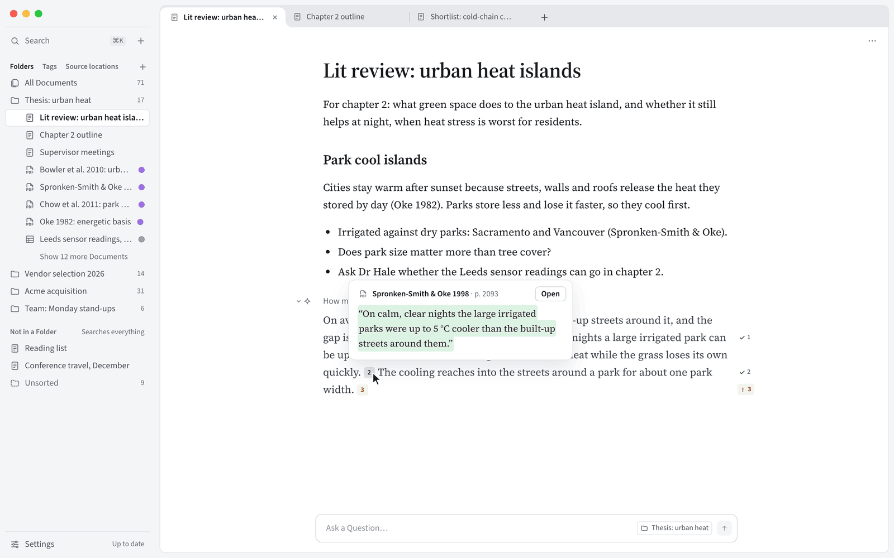

<!-- README.md 与 README.zh-CN.md 逐节对应，修改时请两份一起改。 -->

<p align="center"><a href="README.md">English</a> · <b>简体中文</b></p>

<h1 align="center">IncarnaMind</h1>

<p align="center">
  <b>会自己核对引文的 AI 笔记本。</b><br>
  写作和提问在同一个地方，回答来自你自己的文件和你选的 AI 模型。免费开源，在你自己的电脑上运行。
</p>

<p align="center">
  <a href="#下载"><b>下载</b></a> ·
  <a href="#你能用它做什么">你能用它做什么</a> ·
  <a href="#你的文件始终归你">隐私</a> ·
  <a href="https://github.com/junruxiong/IncarnaMind/discussions">讨论区</a>
  <br><br>
  
  <a href="LICENSE"></a>
  <!-- 第一个版本发布后，加上：<a href="https://github.com/junruxiong/IncarnaMind/releases/latest"></a> -->
</p>

<p align="center"></p>

<p align="center"><sub>选中内容提问、对比表、Word 修订与批注、会议和后台任务<a href="#即将推出">即将推出</a>，其余功能现在就能用。</sub></p>

## 下载

**IncarnaMind 还没有正式发布。** 发布后，[发布页](https://github.com/junruxiong/IncarnaMind/releases)会提供 macOS（Apple 芯片和 Intel）、Windows 和 Linux 的安装包。想在发布时收到通知，可以点本页右上角的 **Watch → Custom → Releases**。想现在试用，可以用 Node.js 24 或更高版本从源码运行：

```shell
git clone https://github.com/junruxiong/IncarnaMind.git && cd IncarnaMind
npm install && npm run dev
```

<details>
<summary>系统不让打开时</summary>

- **Windows** 提示“Windows 已保护你的电脑”：安装程序暂时还没有代码签名。点**更多信息**，再点**仍要运行**。
- **macOS** 提示无法验证 IncarnaMind：在完成公证之前，先打开一次，在警告里点**完成**，再到**系统设置 → 隐私与安全性**里点**仍要打开**。也可以运行 `xattr -dr com.apple.quarantine /Applications/IncarnaMind.app`。未签名的 Mac 版不能自动更新：有新版本时，IncarnaMind 会通知你，并打开下载页面。
- **Linux**：先运行 `chmod +x IncarnaMind-*.AppImage`。Ubuntu 22.04 及以后的版本还要运行 `sudo apt install libfuse2`（24.04 及以后是 `libfuse2t64`）。

</details>

## 你能用它做什么

**边写边问。** 一个 Mind 就是为一个主题准备的笔记本：在 Mind 底部的输入框里提问，回答直接写进你的草稿、光标所在的位置，可以像普通文字一样修改。

**每个回答都能核对。** 回答会标出每个说法的出处，并附上原文引文，再逐条到那个位置核对：找到了打绿勾，没找到就标成橙色；点一下，原文就打开到那一页，引文高亮显示。

**直接用你手上的文件。** 关联你平时用的文件夹，连 Zotero 的存储文件夹也可以：IncarnaMind 就地读取里面的 PDF、Word（连批注一起）、PowerPoint、Excel、CSV、Markdown 和纯文本文件，从不移动或修改它们，文件有变化也会跟着更新。

**文档再多也不乱。** 标签会自动添加，IncarnaMind 还能把文档分进你的文件夹；你自己做的选择都会保留。

**模型由你来选。** 可以用你自己的 OpenAI、Anthropic、Google 密钥，或接入任何兼容 OpenAI 接口的服务；也可以通过 Ollama 使用免费的本地模型，内容不出你的电脑。

**写完就能交。** 把 Mind 导出为 Word，引用自动变成脚注；也可以导出为 Markdown。没通过核对的引用会标上“[未核实]”。

**连接应用和技能，运行前先问你。** 添加连接器（MCP 服务器），或者直接导入你在 Claude Desktop、Cursor 里配置好的；也可以添加技能（标准的 `SKILL.md` 文件夹），内置三个。可能改动内容的工具和技能里的脚本，都要你同意后才会运行。

**中英双语。** 整个界面都有中文和英文。

## 你的文件始终归你

不用注册账号，也没有 IncarnaMind 服务器。你的 Mind 和搜索索引都存在你电脑上的一个数据文件夹里，你的文件原样留在原处。你的问题和为它找到的段落只发给你选的模型，用本地模型时哪儿也不去。API 密钥用系统自带的安全存储加密保存。使用数据只有在你同意后才收集，是[匿名事件](docs/privacy.md#usage-data)，绝不包括你的文件或问题，随时可以在**设置 → 隐私**中关闭。崩溃报告默认关闭，开启后也会先去掉你的内容。

- **发送之前先问你。** IncarnaMind 第一次要把内容发给外部服务之前，会先告诉你要发什么、发给谁，等你同意后才发送。**设置 → 隐私**里列出了每一项，随时可以撤回。
- **要求服务商不保存。** 服务商提供选项的，IncarnaMind 都会要求它不要保存你的请求；发给 OpenAI 的每个请求都带着这个要求。
- **运行什么，由你说了算。** 连接器里可能改动内容的工具，以及技能里的脚本，在运行之前 IncarnaMind 都会先问你：允许这一次、始终允许，或者拒绝。**设置 → 工具**里列出了你设过的每条规则，随时可以撤销。

<details>
<summary><b>常见问题</b></summary>

- **要花钱吗？** 不用。IncarnaMind 开源免费（Apache 2.0 许可证）。用云端模型时，按用量付费给模型服务商；用本地模型则完全免费。
- **一定要有 API 密钥吗？** 不一定。只要 [Ollama](https://ollama.com) 在运行，IncarnaMind 一键就能下载本地模型。也可以填 OpenAI、Anthropic、Google 的密钥，或接入任何兼容 OpenAI 接口的服务。
- **能离线用吗？** 搜索文件可以离线：搜索靠文件里的字词，按含义搜索（嵌入）是可选功能，默认关闭。回答需要模型，所以用本地模型时，全部功能都能离线。
- **会改动我的文件吗？** 不会。它只在原处读取文件，只往自己的数据文件夹和你导出的文件里写内容。
- **“找到引文”是什么意思？** 意思是这段文字确实在引用所指的位置，但不代表它能证明你写的那句话，所以原文永远只差一次点击。“无法核对”表示那里没有可以比对的文字，比如扫描页。
- **怎么备份？** 复制数据文件夹就行，里面有你的 Mind、搜索索引和设置。

</details>

## 即将推出

下面是计划中的功能，现在还不能用，也没有具体日期（见[路线图](https://github.com/junruxiong/IncarnaMind/issues/74)）：会议实时转写，回答可以引用转写内容；打开 Word 文件再导出回去，修改保留为修订；对照你的文件核对你自己的草稿和别人的文档；跨文档的对比表；由你接受或拒绝的 AI 修改；在后台运行的研究任务。

## 参与贡献

欢迎写代码、用你自己的文档测试、翻译和提想法：先读 [CONTRIBUTING.md](CONTRIBUTING.md)（英文），也可以[提交 issue](https://github.com/junruxiong/IncarnaMind/issues/new/choose)，或到[讨论区](https://github.com/junruxiong/IncarnaMind/discussions)提问（中文、英文都可以）。

## 项目由来

IncarnaMind 最早是 2023 年的一个 Python 命令行工具，用来和 PDF 对话，收获了大约 800 个 star；2026 年从头重写成桌面应用，核心只有一个想法：从文件里得到的回答，能核对才真正有用。旧版命令行工具保留在 [`v1-python-cli`](https://github.com/junruxiong/IncarnaMind/tree/v1-python-cli) 标签下。谢谢一直关注它的你；如果 IncarnaMind 对你有用，点个 star，能让更多人看到它。

<details>
<summary>引用 IncarnaMind</summary>

```bibtex
@misc{IncarnaMind2023, author = {Junru Xiong}, title = {IncarnaMind}, year = {2023},
  publisher = {GitHub}, journal = {GitHub Repository},
  howpublished = {\url{https://github.com/junruxiong/IncarnaMind}}}
```

</details>

## 许可证

[Apache License 2.0](LICENSE)。应用内置的字体（Source Serif 4、Source Sans 3 和 JetBrains Mono）采用 [SIL Open Font License 1.1](https://openfontlicense.org)。
